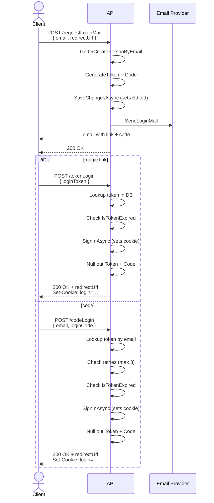

# Authentication

Finder uses a **magic-link / one time password hybrid** flow — no passwords. A user enters their email address and receives an email containing both a one-time link and a six-digit code. Either can be used to complete the login.

---

## Authentication Flow

### Steps in detail

1. **Request** — `POST /api/auth/requestLoginMail`  
   The client sends an email address and an optional `redirectUrl`. The API normalises the email (trim + lowercase), then calls `UserService.GetOrCreatePersonByEmail` to find or create the `Person`.

2. **Token generation** — `LoginService.CreateLoginTokenForPerson`  
   Each `Person` has at most one `LoginToken` row (one-to-one). The method upserts that row with:
   - `Token` — a UUID v4 formatted as a 32-character hex string, used in the magic link.
   - `Code` — a cryptographically random six-digit string (`RandomNumberGenerator.GetInt32`), sent inline in the email body.
   - `Retries = 0` and the supplied `redirectUrl`.  
   `SaveChangesAsync` fires here, which also sets `LoginToken.Edited = UtcNow`. This timestamp is used later to determine expiry.

3. **Email** — `MailService.SendLoginMail`  
   Constructs an HTML email with the code inline and a magic link built from the `LoginLink` template. Users who have never logged in before receive a registration subject/body; returning users receive the standard login copy.

4. **Completion — magic link** — `POST /api/auth/tokenLogin`  
   The frontend receives `?token=…` from the URL. The API looks up the `LoginToken` by token value, checks expiry (`Edited + 1 hour`), calls `SignInAsync` to issue an auth cookie, then nulls out both `Token` and `Code` on the row (one-time use).

5. **Completion — code** — `POST /api/auth/codeLogin`  
   The user types the six-digit code. The API finds the `LoginToken` by email, checks expiry and the retry counter (max 3 wrong attempts before `Code` is nulled and the account is locked out until a new mail is requested), then signs in the same way.

6. **Session** — `GET /api/auth/who`  
   Returns the current user from the auth cookie. Can be called unauthenticated and returns `{ isAuthenticated: false }` in that case. Used by the frontend on startup to restore session state.

7. **Logout** — `POST /api/auth/logout`  
   Calls `SignOutAsync`, which clears the auth cookie.

---

## Key Classes

### `LoginService` (`Services/LoginService.cs`)
The main orchestrator. Owns the three entry points (`RequestLoginMail`, `LoginByToken`, `LoginByCode`) and the shared `SignIn` helper that calls ASP.NET's `SignInAsync` and invalidates the token afterwards.

Notable detail: `IsTokenExpired` compares `DateTime.UtcNow - loginToken.Edited` to a one-hour window. `Edited` is maintained automatically by `AppDbContext.SaveChangesAsync` — it reflects the last time the `LoginToken` row was written to.

### `UserService` (`../Shared/Services/UserService.cs`)
Request-scoped service (matches the DI lifetime of `LoginService`) that resolves and caches the current `Person` from `ClaimTypes.NameIdentifier`. Also owns `GetOrCreatePersonByEmail`, which is the registration gate.

### `LoginToken` (`Entities/LoginToken.cs`)
One row per `Person`. Stores both credentials (`Token`, `Code`), the retry counter, and the post-login `RedirectUrl`. After a successful login, `Token` and `Code` are set to `null` — the row is kept for the next login cycle.

### `Person` (`Entities/Person.cs`)
The user record. Role is an enum (`Admin`, `Upgraded`, `Free`) stored as an integer. The role integer is embedded as a claim in the auth cookie at login time.

### `MailService` (`Services/MailService.cs`)
Thin wrapper around MailKit. Builds the HTML body from `LoginOptions` templates and sends via SMTP with SSL. All exceptions are caught and logged to stdout — the caller always receives a successful result even if the email was not delivered.

### `LoginOptions` / `SmtpOptions` (`Setup/`)
Bound from `appsettings.json`. `AuthToken` is a development escape hatch: when set, every login request uses the same static token and the generated code is printed to stdout, bypassing the email step entirely.

### `AuthApi` (`Api/AuthApi.cs`)
Minimal API endpoint registrations. All endpoints in this file are public — none require an authenticated session. Profile management (display name, language) lives in the `User` feature (`PUT /api/user`, `RequireAuthorization()`).

---

## Configuration

| Key | Description |
|---|---|
| `Login:LoginLink` | URL template. Must contain `{{token}}` and `{{redirecturl}}`. |
| `Login:AuthToken` | Dev only. Fixes the magic-link token and skips email. |
| `Login:Subject` / `Login:Text` | Email content for returning users. |
| `Login:SubjectNew` / `Login:TextNew` | Email content for first-time registrations. |
| `Smtp:Host/Port/User/Password` | SMTP credentials for outbound email. |

---

## Known Flaws and Suggested Fixes

### 1. Silent email failure returns 200 OK

**File:** `MailService.cs:22–57`

All SMTP exceptions are caught and written to stdout. `LoginService.RequestLoginMail` therefore always returns success even when no email was delivered. The user sees no error and has no email to complete login.

**Fix:** Re-throw (or return a `Result.Fail`) so `RequestLoginMail` can return a 500/503 and the client can show an error message.

---

### 2. No rate limiting on `requestLoginMail`

Any unauthenticated caller can POST to `/api/auth/requestLoginMail` in a tight loop, causing email floods to legitimate users and SMTP quota exhaustion.

**Fix:** Add ASP.NET Core's built-in rate limiting middleware (`AddRateLimiter`) with a sliding-window or token-bucket policy keyed on the client IP for this endpoint.

---

### 3. Six-digit code stored in plaintext

**File:** `LoginToken.cs`, `LoginService.cs:152–154`

The OTP code is stored as a plain string. Anyone with read access to the database can see active codes.

**Fix:** Store a HMAC-SHA256 (or bcrypt) hash of the code. Compare the hash of the submitted value against the stored hash.

---

### 4. Stale role in session cookie

**File:** `LoginService.cs:87–90`

The user's role is encoded as a claim in the auth cookie at login time. If an admin changes a user's role in the database, the active session still carries the old role until the user logs out and back in. There is no mechanism to invalidate existing cookies.

**Fix:** Either re-validate the role claim from the database on each request (via a custom `IClaimsTransformation`), or issue short-lived cookies with a refresh mechanism.

---

### 5. Unvalidated redirect URL (open redirect)

**File:** `LoginService.cs:97`, `AuthApi.cs:23–24`

The `RedirectUrl` stored in `LoginToken` is returned verbatim to the frontend after login. If an attacker can craft a login link with a malicious `redirectUrl` (e.g. via phishing), the frontend may redirect the user to an external site.

**Fix:** On the API side, reject values that are not relative paths or do not match a known origin. On the frontend, validate that the URL is same-origin before navigating.
